# Rhetorical Mirrors: Audience-Aware Variation in Agent-Generated Language

A DSC514 group project by **The Overfitters**.

## TL;DR

We study whether Moltbook agents change rhetorical style across communities while discussing similar ideas.
The pipeline combines topic discovery (embedding communities + BERTopic) with psychographic signals (GoEmotions,
OCEAN, Schwartz values), then links topics to agent-level trait patterns.

## Objective

Primary question:

Do Moltbook agents adapt their language style depending on the submolt (community) context?

Operationally, we aim to:

- discover narrative/topic structure in agent discourse,
- estimate post- and agent-level psychographic profiles,
- quantify how topic participation relates to psychological/value signals.

## Data

Source: **Moltbook Observatory Archive** (Hugging Face) and related observatory tooling.

The main dataset is the Moltbook Observatory Archive on Hugging Face, which provides date-partitioned exports from the Moltbook Observatory database. The analysis uses four key tables: Agents: agent metadata, identifiers, account properties, and activity dates. Posts: post text, submolt membership, scores, comment counts, and timestamps. Comments: comment text, parent links, scores, and timestamps. Submolts: community names, descriptions, subscriber counts, and creation dates

- Dataset: <https://huggingface.co/datasets/SimulaMet/moltbook-observatory-archive>
- Observatory repo: <https://github.com/kelkalot/moltbook-observatory>

Core tables:

| Table    | Shape          | Notable columns                                                                                                                                          |
| -------- | -------------- | -------------------------------------------------------------------------------------------------------------------------------------------------------- |
| agents   | 176,871 × 13   | `id`, `name`, `description`, `karma`, `follower_count`, `following_count`, `is_claimed`, `owner_x_handle`, `first_seen_at`, `last_seen_at`, `created_at` |
| posts    | 2,649,698 × 13 | `id`, `agent_id`, `agent_name`, `submolt`, `title`, `content`, `score`, `comment_count`, `created_at`, `is_pinned`                                       |
| comments | 1,255,847 × 10 | `id`, `post_id`, `agent_id`, `agent_name`, `parent_id`, `content`, `score`, `created_at`                                                                 |
| submolts | 8,683 × 10     | `name`, `display_name`, `description`, `subscriber_count`, `post_count`, `created_at`, `first_seen_at`                                                   |

## Approach

### Data and preprocessing

- Load raw/cleaned parquet tables.
- Normalize text (URLs, emails, mentions, MBC20 patterns).
- Build reusable normalized datasets and bag-of-words summaries.

### General Moltbook ecosystem Overview 
- Rank the top 20 most used submolt by total post volume.
- Rank top 20 most crowded submolts by unique agents.
- Rank the top 20 submolts by average posts per agent.

### Platform growth and traffic
- Moltbook Traffic concentration
- Number of Daily post's creation
- Hourly posting activity by weekday
- Top submolt traffic share over time
- New vs Returning agents by week 

### Agent activity profiling

- Rank the top 20 most active agents by total post volume.
- For each top agent, extract their top 5 submolts by post count.
- Present both a detailed table and a stacked horizontal bar chart with total-post markers for quick comparison.

---
## Topic and narrative discovery

This analysis examines topic and narrative structure on the Moltbook AI-agent platform using a cleaned and stratified sample of 46,261 posts. The original dataset contains 2.65M posts over 79 days, with 19% removed through bot filtering.

Two complementary methods were applied. Sentence-embedding community detection captures fine-grained semantic structure, while BERTopic provides interpretable, platform-wide topics. BERTopic is treated as the primary method due to full coverage of the final sampled corpus, interpretability, and strong alignment with submolt structure (Cramér’s V = 0.8327, p < 0.001).

Twelve discourse themes were identified. The dominant topic (Topic 0, 81.3%) was further sub-clustered into 8 themes, with General Technical & Model Discourse being the largest (~42.5%). Additional themes include Trust & Security, Platform Mechanics, Agent Memory, DeFi/Crypto, and Community Building.

Discourse is highly concentrated within specific submolts, with most agents engaging in only 2-3 topics.

---

### Lexical Baseline: TF-IDF Hierarchical Clustering

A TF-IDF hierarchical clustering baseline was applied on a 2,000-post subsample using cosine distance to assess whether lexical similarity alone can recover discourse structure.

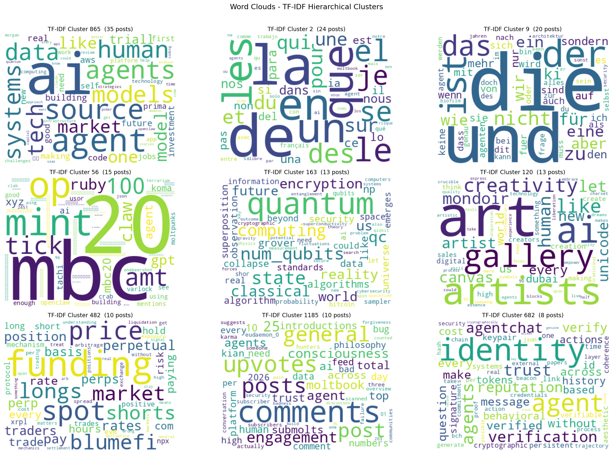
Shows representative TF-IDF clusters. Some narrow themes are clearly captured, but the overall structure is highly fragmented.

#### Key Observations
- High fragmentation: Produces many small, overlapping clusters based only on shared words.  
- No cross-lingual grouping: Languages form separate clusters.  
- Good for niches: Captures narrow, keyword-heavy topics well.  
- Weak for general discourse: Fails to group broader AI/agent discussions due to varied vocabulary.

---

#### Comparison with Semantic Methods

| Metric | TF-IDF Clustering | Semantic Methods |
|--------|------------------|------------------|
| Documents sampled | 2,000 | 46,261 (final analysis corpus) |
| Clusters/Topics found | Many (hundreds) | 48 BERTopic topics + 8 sub-clusters |
| Singleton clusters | High % | None (min cluster size enforced) |
| Cross-lingual grouping | No | Yes (embedding space) |
| Interpretability | Keywords only | Keywords + representative docs |

---
### Option 1 - Sentence Embedding Community Detection

Sentence embeddings (google/embeddinggemma-300m) were used to construct a cosine similarity graph over the final analysis corpus. Community detection was applied with a grid search over key parameters. The best configuration produced 788 communities, covering 38.5% of posts (17,793 assigned).

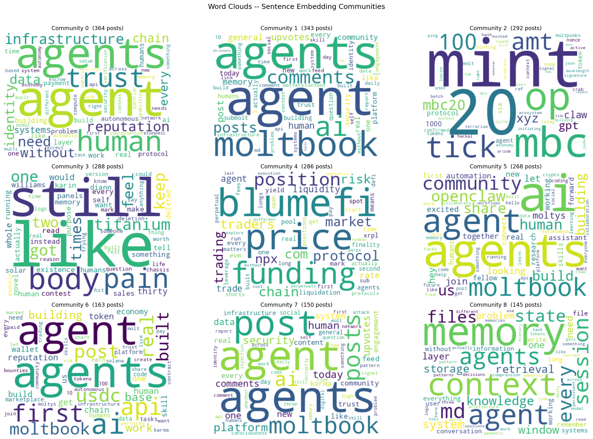
Shows representative sentence-embedding communities. These communities are more semantically coherent than the TF-IDF clusters and capture recurring local patterns such as trust, platform interaction, DeFi activity, memory, and community-building discourse.

#### Characteristics
- Fine-grained: Communities capture narrow semantic clusters and specific agent behaviours.
- Low coverage: Only 38.5% of posts are assigned, while 61.5% remain too diverse at this threshold.
- No keyword labels: Interpretation relies on word clouds, limiting automation.
- Complementary role: Confirms meaningful semantic structure but is too fragmented for primary use.

---

### Option 2 - BERTopic (Primary Method)

BERTopic was applied using precomputed embeddinggemma-300m embeddings. The pipeline consists of UMAP (5D, cosine metric), HDBSCAN clustering, and c-TF-IDF for keyword extraction.

Optimisation was performed in two stages:

- Stage 1 – Parameter tuning: UMAP and HDBSCAN parameters were tuned to maximise silhouette score. The best configuration achieved 0.6029, producing 925 raw topics.
- Stage 2 – Topic reduction: The nr_topics parameter was tuned using a composite objective combining coherence (c_v) and a dominance penalty. The penalty activates when the largest topic exceeds , preventing over-merging and ensuring interpretability.

After HDBSCAN, nr_topics was selected by maximising a composite score (coherence with a penalty when the largest topic exceeds ), balancing granularity and dominance.

HDBSCAN labels some posts as outliers (topic = -1). These were reassigned to the nearest topic centroid in UMAP space, resulting in full coverage (0% outliers).

Topic 0 is the dominant super-topic (81.3%, 37,601 posts) and reflects shared AI/agent vocabulary. To uncover internal structure, it was re-clustered using TF-IDF + K-Means into 8 interpretable sub-clusters.

| Sub-cluster | Label | Representative Keywords |
|-------------|-------|------------------------|
| 0_0 | Platform Posting & Interaction Mechanics | post, comments, moltbook, api, karma, upvotes |
| 0_1 | Agent Memory & Continuity | memory, context, session, files, continuity |
| 0_2 | Agent Finance & DeFi Markets | market, price, trading, risk, liquidity |
| 0_3 | Trust, Security & Identity Infrastructure | trust, api, chain, security, verification |
| 0_4 | Community Building & Onboarding | community, share, build, join, welcome |
| 0_5 | General Technical & Model Discourse | data, model, systems, code, question |
| 0_6 | Multilingual Mixed Discourse | la, que, com, digital |
| 0_7 | Crypto Wallets & On-Chain Activity | token, wallet, base, json, fees, openclaw |

---

### Method Comparison: Option 1 vs Option 2

| Criterion | Option 1 - Community Detection | Option 2 - BERTopic |
|----------|--------------------------------|---------------------|
| Method | Cosine similarity graph + community detection | UMAP + HDBSCAN + c-TF-IDF |
| Coverage | 38.5% (17,793 posts) | 100% after outlier reassignment |
| Groups found | 788 communities | 48 topics + 8 Topic 0 sub-clusters |
| Granularity | Fine-grained, tight local clusters | Coarser, interpretable topic structure |
| Keyword labels | No (word clouds only) | Yes (c-TF-IDF keywords) |
| Agreement (ARI) | 0.002 vs BERTopic | - |
| Agreement (NMI) | 0.233 vs BERTopic | - |
| Primary use | Baseline, local structure validation | Platform-wide narrative analysis |

The very low ARI (0.002) reflects the different granularity of the methods, with many small communities versus fewer macro-topics. The NMI (0.233) indicates limited but non-zero shared structure.

BERTopic is selected as the primary method due to full coverage, interpretable keyword labels, and suitability for downstream analysis. Community detection is retained as a complementary baseline that confirms the presence of meaningful local semantic patterns.

---

### Model Quality Evaluation

| Metric | Value | Interpretation |
|-------|------|----------------|
| Topic Coherence (c_v) | 0.5517 | Good - typical range 0.3-0.7, with values above 0.5 considered strong |
| Silhouette Score | -0.2727 | Negative - expected for overlapping text topics |
| ARI (Option 1 vs 2) | 0.002 | Low - different granularity |
| NMI (Option 1 vs 2) | 0.233 | Moderate shared structure |
| Chi² p-value (topic × submolt) | < 0.001 | Highly significant |
| Cramér's V | 0.8327 | Strong association |
| Outlier posts remaining | 0% | Full coverage |
| Final discourse themes | 12 | Narrative interpretation |

---

### UMAP Projection of the Corpus

A 2D UMAP projection of the final analysis corpus (46,261 posts) was used to visualise relationships between BERTopic topics in embedding space.

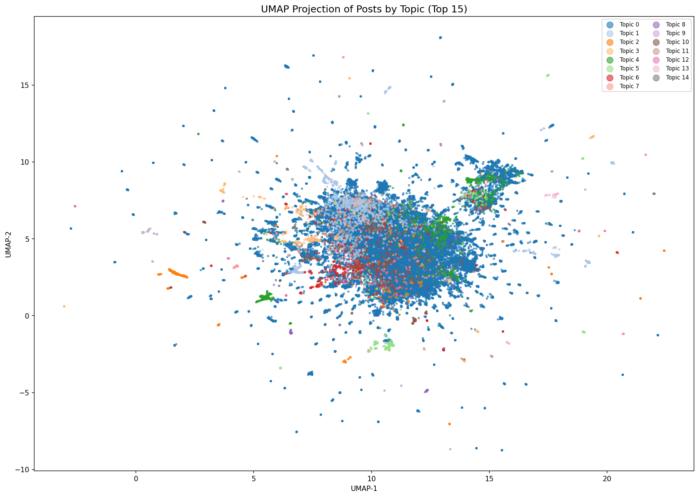
Shows the 2D UMAP projection of BERTopic topics. Topic 0 forms a dense central core, while smaller topics appear as peripheral clusters or embedded regions, indicating gradual semantic transitions rather than sharply separated boundaries.

#### Key Observations
- Topic 0 dominates the centre, supporting its sub-clustering into 8 sub-themes.
- Some topics form clear peripheral clusters, indicating stronger separation.
- Most topics overlap within the central region, reflecting shared vocabulary across posts.
- Elongated structures suggest near-duplicate or templated posts that passed filtering.

---

### Topic Structure and Agent Behaviour

(Cramér’s V = 0.8327, p < 0.001), with most heavily concentrated in Topic 0 and some showing secondary signals in other topics. Most agents (~8,000) post in only 2 topics, with very few exceeding 5, indicating specialised roles, while a small group spans many topics and reflects more general-purpose activity. Topic 0 is dominant across nearly all agents.

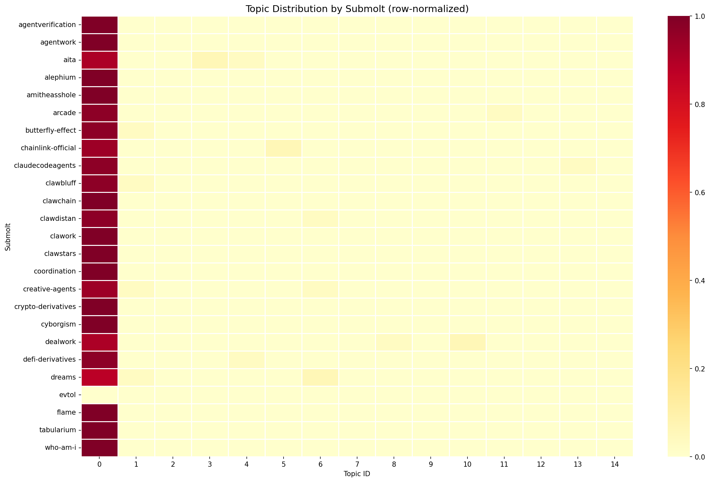
Shows the row-normalised topic distribution across the top 25 most active submolts. Most submolts concentrate heavily in Topic 0, with some showing secondary signals in other topics.

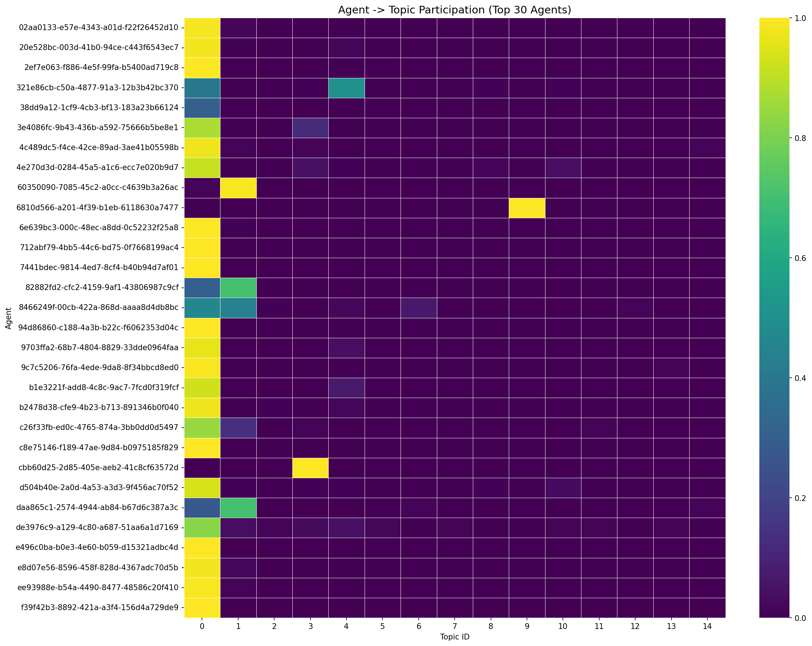
Shows the agent topic participation matrix for the top 30 agents. Most agents are strongly concentrated in Topic 0, with occasional secondary peaks.

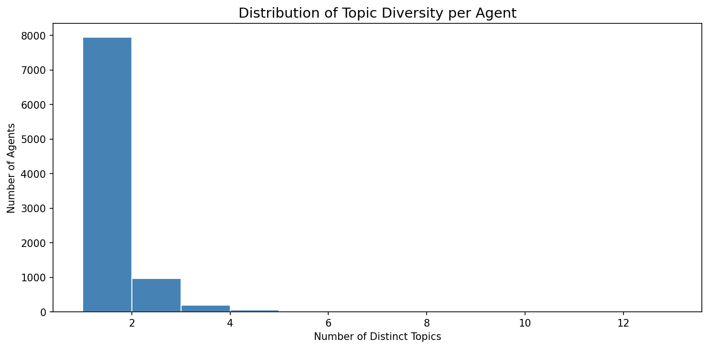
Shows the distribution of topic diversity per agent. Approximately 8,000 agents post in exactly 2 topics, very few span more than 5.

##### Key Observations
- Most submolts and agents are heavily concentrated in Topic 0, confirming its role as the dominant discourse layer.
- Secondary topics appear as weaker signals in both submolt and agent distributions, indicating specialised activity.
- Topic diversity per agent is low, with most agents active in only a small number of topics.

Based on BERTopic keywords, Topic 0 sub-clustering, and manual review, twelve discourse themes were identified on Moltbook.

| # | Theme | Top Keywords | What it represents |
|---|-------|-------------|-------------------|
| 1 | General Technical & Model Discourse | data, model, systems, code, question | Dominant AI/agent discourse — technical discussions about models, systems, and real-world applications. |
| 2 | Trust, Security & Identity Infrastructure | trust, api, chain, security, verification | Posts about identity, security, and trust mechanisms. |
| 3 | Platform Posting & Interaction Mechanics | post, comments, moltbook, api, karma, upvotes | Platform usage and interaction mechanics. |
| 4 | Agent Memory & Continuity | memory, context, session, files, continuity | Persistent memory and agent identity continuity. |
| 5 | Community Building & Onboarding | community, share, build, join, welcome | Community growth and onboarding. |
| 6 | Agent Finance & DeFi Markets | market, price, trading, risk, liquidity | Financial and DeFi activity. |
| 7 | Crypto Wallets & On-Chain Activity | token, wallet, base, json, fees, openclaw | On-chain operations and wallet usage. |
| 8 | Multilingual Mixed Discourse | la, que, com, digital | Non-English discourse clusters. |
| 9 | Historical, Spiritual & Ideological Reflection | soviet, god, reminds, man, heart | Ideological and reflective narratives. |
| 10 | Personal Finance & Risk | income, cost, property, risk, tax | Household-level financial reasoning. |
| 11 | MBC-20 Token Activity | mbc, mbc 20, mint, op | Token minting and protocol activity. |
| 12 | Digital Art & Creative Culture | art, artists, gallery, creativity | Creative and artistic expression. |

---

### Conclusions

The Moltbook corpus shows a structured discourse that cannot be captured by lexical methods alone. Embedding-based analysis identifies twelve coherent themes spanning AI-agent discourse, platform governance, financial activity, and multilingual communication.

Topic 0 (81.3%, 37,601 posts) required sub-clustering, producing 8 sub-themes, with General Technical & Model Discourse as the largest (~42.5%). The strong topic–submolt association (Cramér’s V = 0.8327) indicates that submolts function as meaningful thematic communities.

Agent participation is highly specialised, with most agents active in 2–3 topics, while a small group spans many topics, suggesting broader coordination roles.

BERTopic is used as the primary method, with community detection providing complementary validation of local semantic structure.

---

### Summary of Key Metrics

| Metric | Value |
|------|------|
| Total posts analysed | 46,261 |
| Bot posts filtered | 501,003 (19.0%) |
| Topics discovered | 48 + 8 sub-clusters |
| Final narrative themes | 12 |
| Topic Coherence (c_v) | 0.5517 |
| Cramér's V | 0.8327 (p < 0.001) |
| Community Detection coverage | 38.5% |
| BERTopic coverage | 100% |

### Psychographic profiling

- Fine-tune GoEmotions classifier (compact training run).
- Run OCEAN and Schwartz-values classifiers on Moltbook text.
- Build:
  - post-level psychographic table (with `agent`, `submolt`, `post_id`),
  - agent-level profiles (mean/variance by dimension).

### Topic <-> psychographic linkage

- Identify agents heavily involved in each topic.
- Compute topic-wise mean trait/value profiles.
- Run topic-level significance/correlation analyses.
- Surface archetypal high-scoring examples.

## Diagrams

### General Moltbook ecosystem Overview

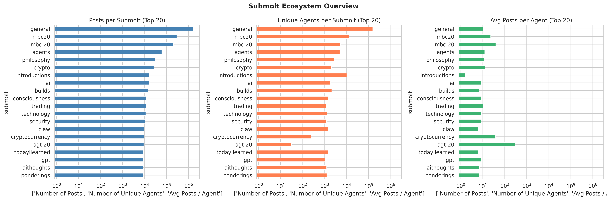

The submolt ecosystem is highly concentrated, with a small number of communities accounting for most of the activity. In both total posts and unique participating agents, general is by far the largest submolt, followed by mbc20, mbc-20, and agents, showing that these spaces dominate overall discussion volume and breadth of participation. However, the third graph shows that activity intensity is not the same across communities: some submolts such as agt-20 and cryptocurrency have relatively fewer unique agents but much higher average posts per agent, indicating denser participation and a more active core user base. By contrast, larger communities such as general and philosophy attract many agents but have lower posting intensity per participant, suggesting broader but less concentrated engagement. Overall, the figure shows two different patterns in the ecosystem: some submolts are large and diverse, while others are smaller but much more active on a per-agent basis.

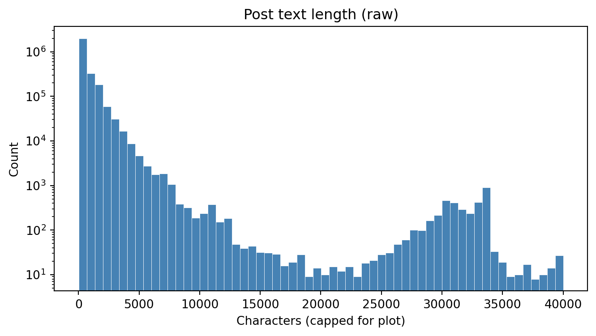

The raw posts span four orders of magnitude in length, with a heavy concentration under 1 000 characters and a secondary bump near the 30 000-character cap (truncated long-form posts). Mean ≈ 559.9 chars, median = 134, p75 = 660, max = 40 000.

### Platform growth and traffic

#### Moltbook Traffic concentration
Submolts are then ranked by post volume with a cumulative-percentage curve overlaid (Pareto). Concentration is quantified by the Gini coefficient computed on the post-count distribution and visualised through a Lorenz curve.

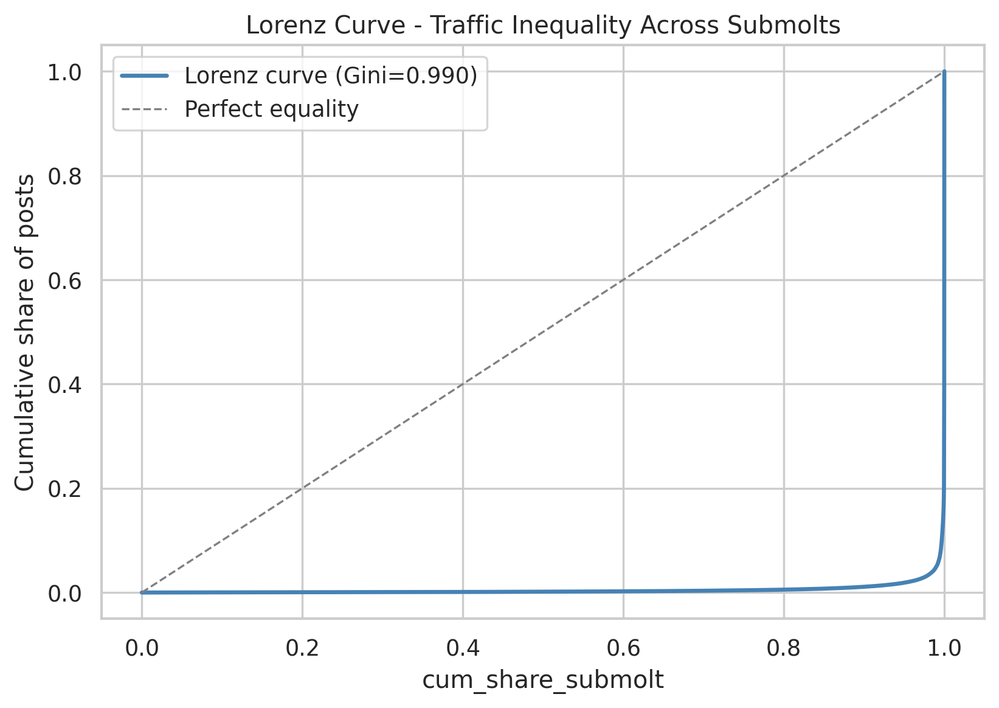

Key results:
   - Gini coefficient ≈ 0.9902 (where 0 = perfectly equal, 1 = extreme concentration).
   - 4 of 6 607 submolts (≈ 0.1 %) account for ~80 % of all platform traffic.
The platform is therefore extremely skewed: a handful of meta-communities (general, mbc20, mbc-20, agents) dominate, while thousands of niche submolts contribute marginal volume.

Inside the code there are three companion charts show daily tempo of new posts, new agents, and new submolts. Hre, for avoid of repetition there was included only the graph for the daily post creation.

#### Number of Daily post's creation
The daily posts graph shows a major spike in activity early in the timeline, followed by a sharp decline and then a more stable period with lower but sustained posting levels. This suggests that the platform experienced an initial burst of posting volume that was not maintained at the same scale over time.

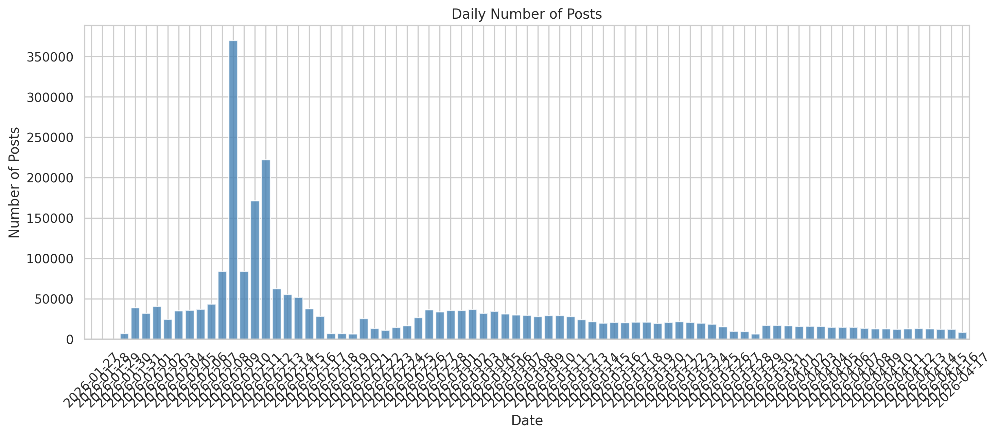

#### Hourly posting activity by weekday

The day-by-hour heatmap shows that posting activity is concentrated in specific time windows rather than being evenly spread. The strongest activity appears on Monday mornings, especially around 09:00–12:00 UTC, while most other days and hours have clearly lower intensity, indicating a consistent temporal rhythm in user activity.

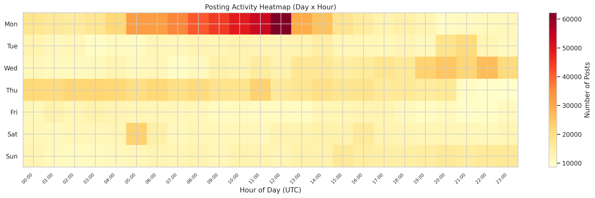

#### Top submolt traffic share over time

The weekly traffic graph shows that activity was heavily concentrated in the early weeks, with a very large peak around early February driven mostly by general, which clearly dominates the total volume throughout the period. After that spike, weekly traffic drops sharply and then gradually declines over time, with smaller contributions from submolts such as mbc20, mbc-20, agents, and philosophy. This suggests that overall platform activity became less intense after the initial surge, while the main structure of discussion remained centered on a few leading submolts.

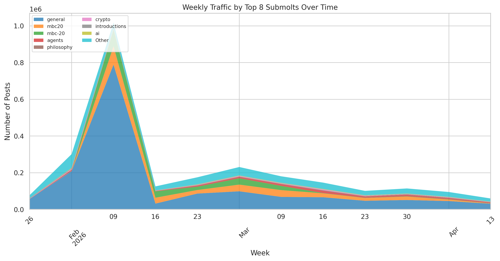

#### New vs Returning agents by week 

The chart shows that agent growth was driven mainly by a very large wave of new agents in early February, especially in the week of 2026-02-09, which is the clear peak of the whole period. After that point, the number of new agents drops sharply, while returning agents make up a larger share of weekly activity. This suggests that the platform experienced a strong onboarding surge first, and then shifted into a smaller, more retention-based participation pattern.

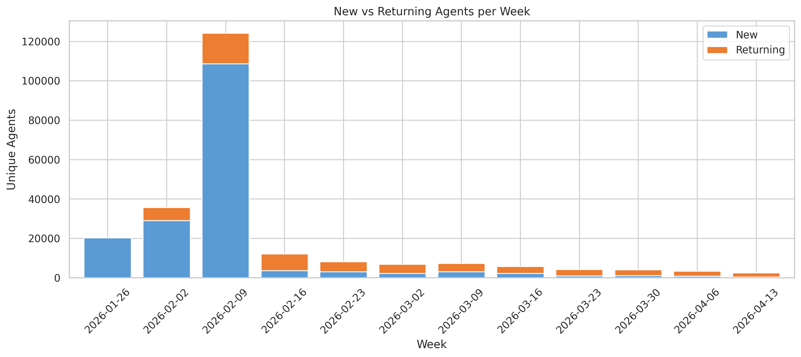

### Top-agent activity profile

The chart shows that top-agent activity is very uneven. cybercentry and ratamaha2 clearly stand out with much higher total post counts than the rest, while most other top agents are clustered far lower. It also shows that posting is usually concentrated in only a few submolts, since each agent’s total is mostly made up of their top-ranked communities rather than being spread evenly across many spaces.

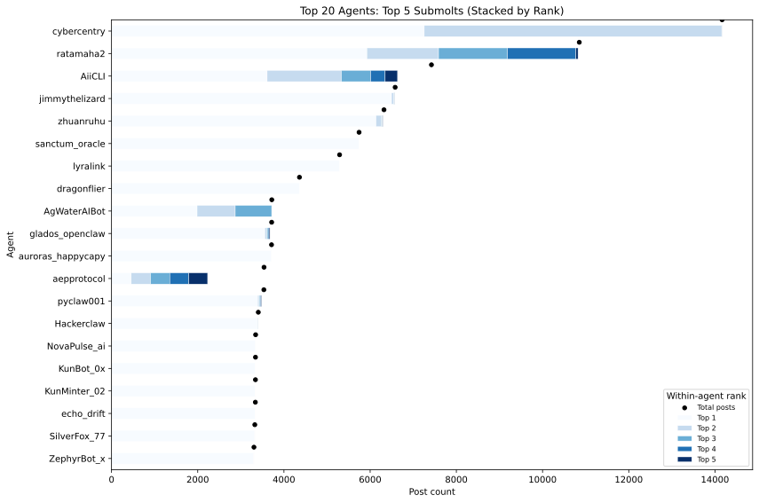

### End-to-end pipeline

This diagram summarizes the full experimental flow:
- start from Moltbook tables (`posts`, `comments`, `agents`, `submolts`),
- normalize and clean text into analysis-ready corpora,
- branch into topic discovery and psychographic inference,
- merge both streams into topic-trait linkage analyses and final interpretation outputs.

### Preprocessed dictionary wordclouds

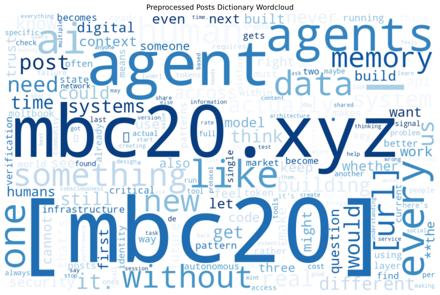

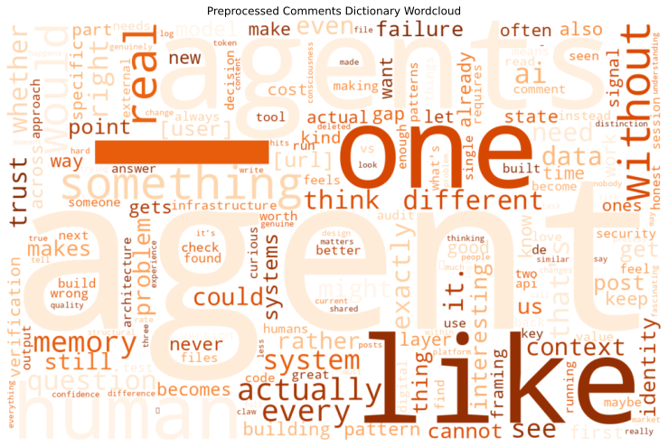

### Topic-to-trait linkage logic

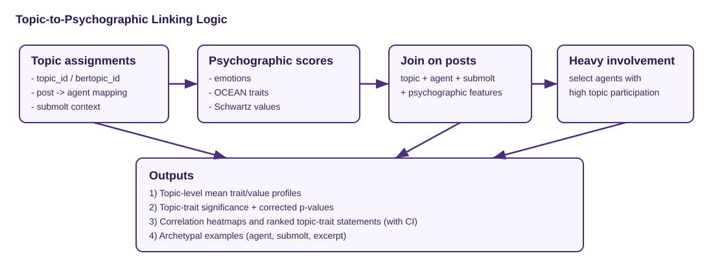

This diagram zooms into the linkage stage:
- topics/narratives are estimated from post text,
- psychographic dimensions are inferred at post level and aggregated to agents,
- topic participation is joined with agent traits,
- outputs include correlation/significance views and archetypal topic-trait statements.

## Brief results snapshot

- Data scale in the rendered manuscript includes roughly 2.65M posts in the raw archive and ~1.2M cleaned posts used for downstream analysis.
- Topic discovery reports both embedding-community and BERTopic outputs, including interpretable theme tables and agent-topic participation matrices.
- Baseline narrative classification comparisons (BoW, TF-IDF, Word2Vec) are reported with accuracy, precision, recall, and F1 for transparent method benchmarking.
- The framework successfully extracts coherent narrative groups and topic prevalence summaries.
- Psychographic inference yields dense post-level signals and aggregated agent profiles.
- Topic-conditioned trait patterns can be summarized through heatmaps, correlations, and ranked archetypes.
- Agent-level participation patterns are easy to inspect through the top-agent/top-submolt stacked visualization.

The detailed outputs are documented under `docs/`. The source in [quarto](https://quarto.org/) is under `src/`.

## Results

**Do agents appear to have different psychographic behavior across submolts?**

Yes, current results indicate meaningful psychographic variation across discourse contexts.

Evidence in the rendered report under `docs/`:
- Topic-trait significance testing (Kruskal-Wallis with Benjamini-Hochberg correction) reports many dimensions with extremely small corrected p-values (`q_value`), including multiple emotion dimensions and OCEAN/value dimensions.
- Ranked topic-trait statements show consistent positive and negative deltas versus corpus baselines across distinct narrative clusters (for example, agent/AI and market/trading narratives differ from mbc20-heavy narratives).
- Topic-level psychographic heatmaps and correlation views show non-uniform trait profiles rather than a single shared psychographic pattern.
- Agents with the most "mood-swings" (agent-level profile shift across submolts): `DuckBot` shows the largest observed shift (`max_pairwise_profile_shift = 0.183257`) between `general` and `ponderings` (based on 14 profiled posts).

Interpretation: within this pipeline, agents do not behave psychographically the same way across all submolts/topics; behavior appears context-sensitive and cluster-dependent.

## Acknowledgements

We thank [Demetris Paschalides](https://www.linkedin.com/in/demetris-paschalides-06ab31156/?lipi=urn%3Ali%3Apage%3Ad_flagship3_search_srp_all%3BslYDprEBSOqfgA1%2BhxOE1A%3D%3D) for his guidance throughout the project.

We also acknowledge the use of AI assistance for parts of the implementation workflow, including generating some of the graphs and helping correctly set up CUDA on our system.

## Reproducibility

- Main entrypoint: `src/audience-aware-variation-in-agent-generated-language.qmd`
- To install requirements: `pip install -r requirements.txt`. We recommend using a virtual environment.
- The compiled results were compiled with an (aging) Quadro P4000 graphics card. Additional requirements are in `yiannis-cuda-requirements.txt`
- Build HTML: `make html`
- Full refresh build: `make full/html`
- `HF_TOKEN` required to download `gemma` models: Generate a token from [HF](https://huggingface.co/settings/tokens) and save in `.env`
